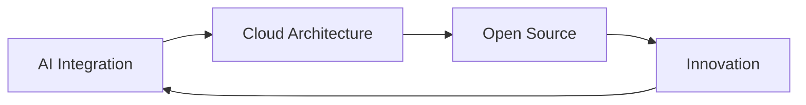

<div align="center">

# **Le Tuan Minh**
### *Full Stack Developer | AI Enthusiast*


<br/>

```ascii
╔══════════════════════════════════════════════════════════════════════════════╗
║                                                                              ║
║     "When i win, even my ancestors will chant my name -                      ║
║      not for victory, but for turning pain into legacy"                      ║
║                                                                              ║
╚══════════════════════════════════════════════════════════════════════════════╝
```

[](https://github.com/tuosminh) 
[](mailto:llttminh@gmail.com)
[](https://gitlab.com/tminhhh)


</div>

---

## **About Me**

<table align="center">
<tr>
<td width="50%">

### **Achievements**
- **Software Engineering Graduate** - Duy Tan University
- **AI & Full Stack Specialist**

### **Current Focus**
- **AI-Powered Applications**
- **Streaming Platform Development**
- **Cloud-Native Architecture**

</td>
<td width="50%">

### **Quick Facts**
```yaml
name: "Le Tuan Minh"
role: "Backend & AI Developer"
education: "Duy Tan University"
specialization: ["AI Integration", "Web Development"]
passion: "Building scalable solutions"
motto: "Be kind"
```

</td>
</tr>
</table>

---

## **Technology Arsenal**

<div align="center">

### **Frontend Mastery**


### **Mobile Developer**


### **Backend Excellence**


### **Database Management**


### **DevOps & Tools**


</div>

---

## **Featured Projects**

<div align="center">

### **GreenEduMap - DTUDZ**
**Bản đồ học tập – môi trường – năng lượng mở của thành phố thông minh**

<a href="https://github.com/HoDuongQuocHuy278/GreenEduMap---DTUDZ">
  
</a>

</div>

<table align="center">
<tr>
<td width="50%">

#### **Key Features**
- **Smart City Mapping** - Interactive learning map for environment & energy
- **Data Visualization** - Real-time environmental data tracking
- **Sustainability Focus** - Open energy management platform
- **Educational Platform** - Learning resources for smart cities
- **Open Source** - Community-driven development

</td>
<td width="50%">

#### **Tech Stack**
- **Frontend**: React, TypeScript, Web3.js
- **Backend**: Node.js, Express, GraphQL
- **Blockchain**: Ethereum, Smart Contracts, IPFS
- **Database**: PostgreSQL, MongoDB
- **Storage**: IPFS for decentralized storage
- **Security**: JWT, OAuth2, SSI Layer

</td>
</tr>
</table>

---

<div align="center">

### **StreamMart - E-Commerce Platform**
**Modern e-commerce solution with seamless shopping experience**

<a href="https://gitlab.com/tminhhh/streammart.git">
  
</a>

</div>

<table align="center">
<tr>
<td width="50%">

#### **Key Features**
- **Product Management** - Comprehensive catalog system
- **Payment Integration** - Secure checkout process
- **Order Tracking** - Real-time order status updates
- **User Accounts** - Personalized shopping experience
- **Search & Filter** - Advanced product discovery

</td>
<td width="50%">

#### **Tech Stack**
- **Frontend**: React Native, TypeScript
- **Backend**: Laravel, PHP
- **Database**: MySQL, MongoDB
- **Payment**: Payment Gateway Integration
- **Deployment**: Docker, Cloud Infrastructure
- **API**: RESTful APIs

</td>
</tr>
</table>

---

<div align="center">

### **TMinhCinema - Movie Booking System**
**Online cinema ticket booking platform with modern UI/UX**

<a href="https://gitlab.com/tminhhh/fe_tminhcinema_deployver2.git">
  
</a>

</div>

<table align="center">
<tr>
<td width="50%">

#### **Key Features**
- **Ticket Booking** - Easy and fast reservation system
- **Showtime Management** - Real-time schedule updates
- **Movie Information** - Detailed film descriptions and trailers
- **Seat Selection** - Interactive seat map booking
- **Multi-Platform** - Web and mobile support

</td>
<td width="50%">

#### **Tech Stack**
- **Frontend**: VueJS, TypeScript, Responsive Design
- **Backend**: Laravel, PHP
- **Database**: MySQL
- **Payment**: Secure payment processing
- **Deployment**: Cloud deployment (v2)
- **UI/UX**: Modern, user-friendly interface

</td>
</tr>
</table>

---

## **GitHub Analytics**

<div align="center">

<table>
<tr>
<td width="50%" align="center">

### **GitHub Statistics**

[](https://github.com/tuosminh)

</td>
<td width="50%" align="center">

### **Top Languages**

[](https://github.com/tuosminh)

</td>
</tr>
</table>

<table>
<tr>
<td width="100%" align="center">

### **Contribution Graph**

[](https://github.com/tuosminh)

</td>
</tr>
</table>

<table>
<tr>
<td width="100%" align="center">

### **GitHub Streak**

[](https://git.io/streak-stats)

</td>
</tr>
</table>

</div>

---

## **What's Next?**

<div align="center">



</div>

- **Cloud-Native Applications** - Microservices & Serverless
- **Open Source Contributions** - Community-driven development
- **AI/ML Research** - Next-generation recommendation systems
- **Knowledge Sharing** - Mentoring & Technical Writing

---

## **Let's Connect**

<div align="center">

<table>
<tr>
<td align="center">
<a href="mailto:llttminh@gmail.com@gmail.com">

</a>
</td>
<td align="center">
<a href="https://gitlab.com/tminhhh">

</a>
</td>
<td align="center">
<a href="https://github.com/tuosminh">

</a>
</td>
</tr>
</table>

### **Open for collaboration on:**
- Streaming platform innovations
- AI-powered applications  
- Full-stack web development
- Game development projects

</div>

---

<div align="center">

### **"Innovation through code, impact through collaboration"**


**Thank you for visiting my profile**  
**[Le Tuan Minh](https://github.com/tuosminh) | Building the future, one commit at a time**

</div>
