<div align="center">

# 🌟 **Le Tuan Minh** 🌟
### 🚀 *Full Stack Developer | AI Enthusiast *


<br/>

```ascii
╔══════════════════════════════════════════════════════════════════════════════╗
║                                                                              ║
║     "When i win, even my ancestors will chant my name -                      ║
║      not for victory. but for turning pain into legacy"                      ║
║                                                                              ║
╚══════════════════════════════════════════════════════════════════════════════╝
```

[](https://github.com/tuosminh) 
[](mailto:llttminh@gmail.com)
[](https://gitlab.com/tminhhh)


</div>

---

## 🎓 **About Me**

<table>
<tr>
<td width="50%">

### 🏆 **Achievements**
- 🎓 **Software Engineering Graduate** - Duy Tan University
- 🌟 **AI & Full Stack Specialist**

### 🎯 **Current Focus**
- 🤖 **AI-Powered Applications**
- 🎬 **Streaming Platform Development**
- ☁️ **Cloud-Native Architecture**

</td>
<td width="50%">

### 🔥 **Quick Facts**
```yaml
name: "Le Tuan Minh"
role: "Backend & AI Developer"
education: "Duy Tan University"
specialization: ["AI Integration", "Web Development"]
passion: "Building scalable solutions"
motto: "Be kind"
```

</td>
</tr>
</table>

---

## 🛠️ **Technology Arsenal**

<div align="center">

### **Frontend Mastery**


### **Backend Excellence**


### **Database Management**


### **DevOps & Tools**


</div>

---

## 🏆 **Featured Projects**

<div align="center">

### 🌿 **GreenEduMap - DTUDZ**
**Bản đồ học tập – môi trường – năng lượng mở của thành phố thông minh**

<a href="https://github.com/HoDuongQuocHuy278/GreenEduMap---DTUDZ">
  
</a>

</div>

<table>
<tr>
<td width="50%">

#### 🌟 **Key Features**
- 🗺️ **Smart City Mapping** - Interactive learning map for environment & energy
- 📊 **Data Visualization** - Real-time environmental data tracking
- 🌱 **Sustainability Focus** - Open energy management platform
- 🎓 **Educational Platform** - Learning resources for smart cities
- 🔄 **Open Source** - Community-driven development

</td>
<td width="50%">

#### 🛠️ **Tech Stack**
- **Frontend**: React, TypeScript, Web3.js
- **Backend**: Node.js, Express, GraphQL
- **Blockchain**: Ethereum, Smart Contracts, IPFS
- **Database**: PostgreSQL, MongoDB
- **Storage**: IPFS for decentralized storage
- **Security**: JWT, OAuth2, SSI Layer

</td>
</tr>
</table>

---

<div align="center">

### 🛒 **StreamMart - E-Commerce Platform**
**Modern e-commerce solution with seamless shopping experience**

<a href="https://gitlab.com/tminhhh/streammart.git">
  
</a>

</div>

<table>
<tr>
<td width="50%">

#### 🌟 **Key Features**
- 🛍️ **Product Management** - Comprehensive catalog system
- 💳 **Payment Integration** - Secure checkout process
- 📦 **Order Tracking** - Real-time order status updates
- 👤 **User Accounts** - Personalized shopping experience
- 🔍 **Search & Filter** - Advanced product discovery

</td>
<td width="50%">

#### 🛠️ **Tech Stack**
- **Frontend**: React Native, TypeScript
- **Backend**: Laravel, PHP
- **Database**: MySQL, MongoDB
- **Payment**: Payment Gateway Integration
- **Deployment**: Docker, Cloud Infrastructure
- **API**: RESTful APIs

</td>
</tr>
</table>

---

<div align="center">

### 🎬 **TMinhCinema - Movie Booking System**
**Online cinema ticket booking platform with modern UI/UX**

<a href="https://gitlab.com/tminhhh/fe_tminhcinema_deployver2.git">
  
</a>

</div>

<table>
<tr>
<td width="50%">

#### 🌟 **Key Features**
- 🎫 **Ticket Booking** - Easy and fast reservation system
- 📅 **Showtime Management** - Real-time schedule updates
- 🎭 **Movie Information** - Detailed film descriptions and trailers
- 💺 **Seat Selection** - Interactive seat map booking
- 📱 **Multi-Platform** - Web and mobile support

</td>
<td width="50%">

#### 🛠️ **Tech Stack**
- **Frontend**: VueJS, TypeScript, Responsive Design
- **Backend**: Laravel, PHP
- **Database**: MySQL
- **Payment**: Secure payment processing
- **Deployment**: Cloud deployment (v2)
- **UI/UX**: Modern, user-friendly interface

</td>
</tr>
</table>

---

## 📊 **GitHub Analytics**

<div align="center">

<table>
<tr>
<td width="50%" align="center">

### 📈 **GitHub Statistics**

[](https://github.com/tuosminh)

</td>
<td width="50%" align="center">

### 💻 **Top Languages**

[](https://github.com/tuosminh)

</td>
</tr>
</table>

<table>
<tr>
<td width="100%" align="center">

### 🔥 **Contribution Graph**

[](https://github.com/tuosminh)

</td>
</tr>
</table>

<table>
<tr>
<td width="100%" align="center">

### ⚡ **GitHub Streak**

[](https://git.io/streak-stats)

</td>
</tr>
</table>

</div>

---

## 🌟 **What's Next?**

```mermaid
graph LR
    A[🤖 AI Integration] --> B[☁️ Cloud Architecture]
    B --> C[🌍 Open Source]
    C --> D[🚀 Innovation]
    D --> A
```

<div align="center">



</div>

- 🌐 **Cloud-Native Applications** - Microservices & Serverless
- 🤝 **Open Source Contributions** - Community-driven development
- 🧠 **AI/ML Research** - Next-generation recommendation systems
- 🎓 **Knowledge Sharing** - Mentoring & Technical Writing

---

## 📬 **Let's Connect!**

<div align="center">

<table>
<tr>
<td align="center">
<a href="mailto:llttminh@gmail.com@gmail.com">

</a>
</td>
<td align="center">
<a href="https://gitlab.com/tminhhh">

</a>
</td>
<td align="center">
<a href="https://github.com/tuosminh">

</a>
</td>
</tr>
</table>

### **💬 Open for collaboration on:**
- 🎬 Streaming platform innovations
- 🤖 AI-powered applications  
- 🌐 Full-stack web development
- 🎮 Game development projects

</div>

---

<div align="center">

### 🎯 **"Innovation through code, impact through collaboration"**


⭐️ **Thank you for visiting my profile!** ⭐️  
**[Le Tuan Minh](https://github.com/tuosminh) | Building the future, one commit at a time**

</div>
